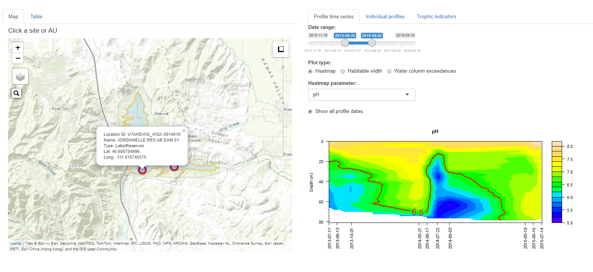
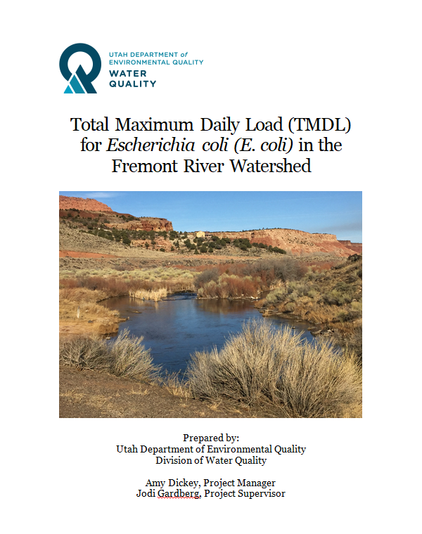
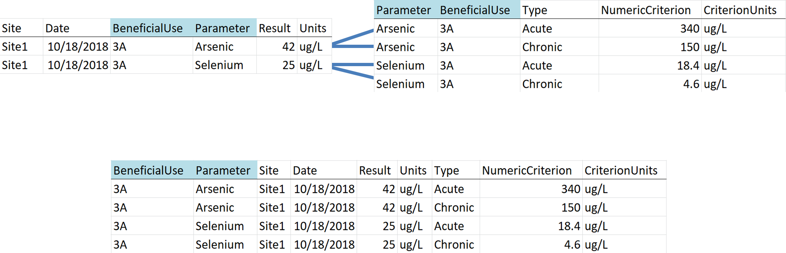
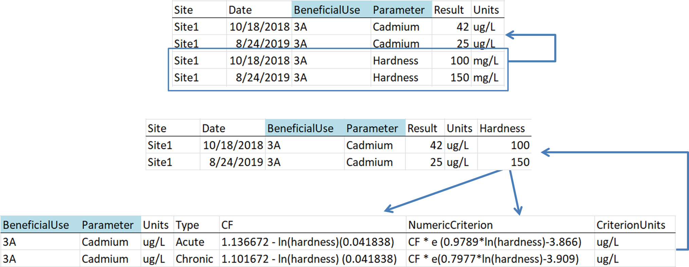
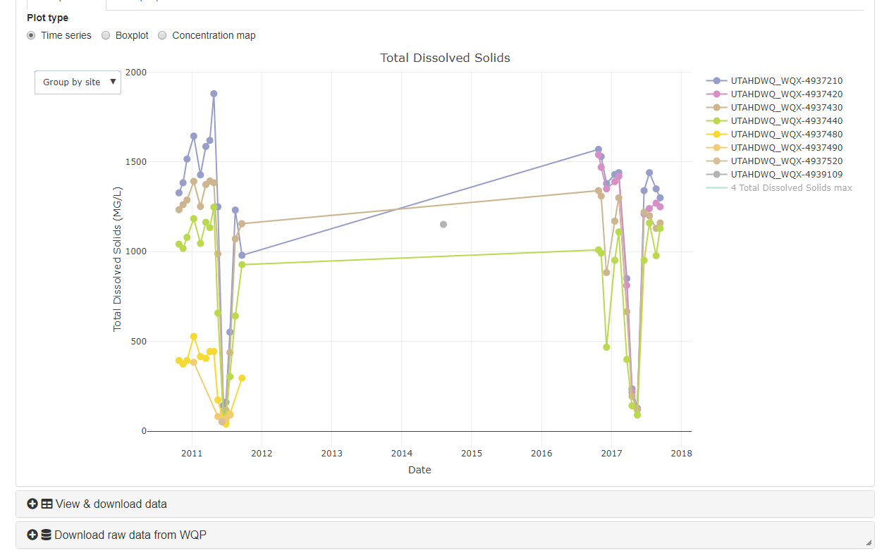

---
output:
  revealjs::revealjs_presentation:
    transition: none
    background_transition: none
---


# R tools at Utah DWQ
<h5>Jake Vander Laan (jvander@utah.gov)</h5>  

```{r, echo=F, fig.align="center"}
knitr::include_graphics('images/title-logo.PNG')
library(wqTools)
```

<h5> Use arrow keys or navigator in bottom right to navigate slides. Press escape for presentation overview.</h5>  

<br>

# Why use open source, code-based workflows?

- Transparency
- Repeatability
- Efficiency
- Flexibility
- Ownership

# What do we these tools for?

- Querying/downloading data  
- Water quality assessments
- Data visualization
- Documenting & communicating analyses
- Wasteload analysis (in development)

# Our general approach

1. Reusable, generalizable ***<span style="color:#2e6da4">functions</span>*** with flexible inputs
2. Use ***<span style="color:#2e6da4">arguments</span>*** to modify functions, instead of re-programming
3. Link ***<span style="color:#2e6da4">functions in series</span>*** to perform analyses
4. ***<span style="color:#2e6da4">Document</span>*** functions and analyses
5. Use ***<span style="color:#2e6da4">interactive</span>*** tools, figures, and applications to enhance efficiency and user understanding


# What tools do we use?

## R
R is an open source statistical program and coding language.  
[r-project.org](https://www.r-project.org/){target="_blank"}

<br>
Robust user community of coders & problem solvers.  
Fully customizable.  
<br>

## R
**Functions & packages**  

- Function:  
A block of code that performs a particular task or set of tasks. A function has a name, **arguments**, a body (code), and a return value.  

- Argument:  
Change-able inputs to a function.  

- Package:  
A portable collection of R functions.  

## R documentation 

- Help files
```{r, out.width='65%', fig.align="left", echo=F}
knitr::include_graphics('images/assignAUs-help.PNG')
```

- [Package manuals](https://github.com/ut-ir-tools/irTools/blob/master/irTools_0.0.0.9000.pdf){target="_blank"}  


## Markdown
Text formatting syntax that allows conversion of plain text to rich text HTML, PDF, and other document types including ***<span style="color:#2e6da4">tables, figures, and code</span>***.

- Documents (package rmarkdown)
- Chapters & books (package bookdown)
- Presentations
- Dashboards
- Websites 

## R Markdown - Bookdown
Compile documents into books. Document complex processes & user build guides.   

**Example:** [Utah IR R tools user guide](https://bookdown.org/jakevl/IR-R-tools-guide/){target="_blank"}
<iframe src="https://bookdown.org/jakevl/IR-R-tools-guide/" style="height:400px;width:1000px" data-external="1"></iframe>  


## Data portals & web services
**Water quality data portal**  
[waterqualitydata.us/portal](https://www.waterqualitydata.us/portal/){target="_blank"}  
```{r, echo=F, fig.align="center"}
knitr::include_graphics('images/wqp.png')
```

## Data portals & web services
**Web service capabilities**
```{r, echo=F, fig.align="center"}
knitr::include_graphics('images/wqp_web_services.png')
```

## Data portals & web services
```{r, eval=F}
two_site_nr=readWQP(type="narrowresult",
			        siteid=c("UTAHDWQ_WQX-4900440","UTAHDWQ_WQX-4900470"), 
					start_date="01/01/2016", end_date="12/31/2018")

utah_lake_nr=readWQP(type="narrowresult",
   					 auid=c('UT-L-16020201-004_01', 'UT-L-16020201-004_02'),
   					 start_date="01/01/2016", end_date="12/31/2018",
   					 siteType="Lake, Reservoir, Impoundment")
```

```{r, echo=F, cache=T, results='hide'}
library(leaflet)
ul_poly=subset(wqTools::au_poly, ASSESS_ID %in% c('UT-L-16020201-004_01', 'UT-L-16020201-004_02'))
bbox=sf::st_bbox(ul_poly)
sites=readWQP(type='sites', auid=c('UT-L-16020201-004_01', 'UT-L-16020201-004_02'), siteType="Lake, Reservoir, Impoundment")
map3=wqTools::buildMap(sites=sites, plot_polys=F) %>% 
	hideGroup('Sites') %>%
	addPolygons(data=ul_poly, popup=~ASSESS_ID) %>% 
	addLayersControl(
		position ="topleft",
		baseGroups = c("Topo","Satellite"), overlayGroups='Sites') %>%
	fitBounds(bbox[[1]], bbox[[2]], bbox[[3]], bbox[[4]]) %>%
	leaflet.extras::removeSearchFeatures()
htmlwidgets::saveWidget(map3, file=paste0(getwd(),'/figures/map3.html'))
```
<iframe src="figures/map3.html" style="height:300px;width:400px" data-external="1"></iframe>

## Data portals & web services
**ECHO** 
```{r, echo=F, fig.align="center"}
knitr::include_graphics('images/echo.png')
```

## Data portals & web services
**ECHO** 
```{r}
UT0021717_tp_001=readECHO_ec(p_id="UT0021717", 
	parameter_code="00665", outfall="001", print=F)
UT0021717_tp_001_effluent=subset(UT0021717_tp_001, 
	monitoring_location_desc=="Effluent Gross")
```

```{r, echo=F}
library(kableExtra)
tab=UT0021717_tp_001_effluent[,c("npdes_id","monitoring_period_end_date","parameter_desc","dmr_value_standard_units","limit_unit_desc","statistical_base_short_desc")]
tab=tab[order(as.Date(tab$monitoring_period_end_date, format='%m/%d/%Y'), decreasing = T),]
knitr::kable(head(tab), col.names=c('Permit ID', 'Date', 'Parameter', 'Result', 'Units', 'Stat'), row.names=F, format='html') %>% kable_styling(font_size = 22)
```

## GitHub
Collaborative code writing, versioning, & sharing platform.  
Individuals, organizations, teams, and repositories.  

## GitHub
**DWQ GitHub organization**  
A location for DWQ staff to store, collaborate, and share repositories.  
[github.com/utah-dwq](https://github.com/utah-dwq){target="_blank"}  

**DWQ R packages**  
DWQ has two packages in current development. These can be viewed and installed via GitHub.  

* [wqTools](https://github.com/utah-dwq/wqTools){target="_blank"}  
* [irTools](https://github.com/utah-dwq/irTools){target="_blank"}  
<br>


## R-Shiny
Shiny is an R package for building interactive web applications to visualize and analyze data and communicate analytical results.  
<br>
```{r, echo=F}
knitr::include_app("https://jakevl.shinyapps.io/shiny-example", height="400px")
```

# Examples

## Querying & processing data
<iframe src="https://bookdown.org/jakevl/ul_data_query/" style="height:500px;width:1000px" data-external="1"></iframe>  
[Full page](https://bookdown.org/jakevl/ul_data_query/){target="_blank"}

## Salinity in Great Salt Lake
An [analysis of changes in salinity in Great Salt Lake](https://bookdown.org/jakevl/gsl-sac1-figs/){target="_blank"} in response to changes to in hydrologic connectivity through a railroad causeway that bisects the lake.
<iframe src="figures/gsl_sal_ts.html" style="height:400px;width:900px" data-external="1"></iframe>  

## GSL Salinity Dashboard
<iframe src="figures/gsldb.html" style="height:600px;width:900px" data-external="1"></iframe>

## Utah's Lake Dashboard
Interactively visualize lake profile & trophic indicator data.  
[View on the DWQ Shiny apps server](https://udwq.shinyapps.io/lakedashboard/){target="_blank"}
```{r, echo=F, fig.align="center"}

```
[Source code](https://github.com/utah-dwq/irTools/tree/master/inst/lakeDashboard){target="_blank"}

## Utah Lake Data Explorer
Analyze and visualize water quality data in Utah Lake.

[View on the DWQ Shiny apps server](https://udwq.shinyapps.io/UtahLakeDataExplorer/){target="_blank"}
```{r, echo=F, fig.align="center"}
knitr::include_graphics('images/utah-lake.png')
```

[Source code](https://github.com/utah-dwq/UtahLakeDataExplorer){target="_blank"}

## TMDL development
*Fremont River E.coli TMDL*
```{r, echo=F, out.width = "600px", fig.align="center"}

```

## TMDL development
[View on the DWQ Shiny apps server](https://udwq.shinyapps.io/ecoliDataExplorer/){target="_blank"}

```{r, echo=F, fig.align="center"}
knitr::include_graphics('images/ecoli_upload.png')
```
[Source code](https://github.com/utah-dwq/tmdlTools){target="_blank"}

## TMDL development
*Timeseries*
```{r, echo=F, fig.align="center"}
knitr::include_graphics('images/ecoli_timeseries_plot.png')
```

## TMDL development
*Monthly trends*
```{r, echo=F, fig.align="center"}
knitr::include_graphics('images/ecoli_monthly_plot.png')
```

## TMDL development
*Load duration curves*
```{r, echo=F, fig.align="center"}
knitr::include_graphics('images/ecoli_ldc_plot.png')
```

# Integrated Report
<br>
```{r, echo=F, fig.align="center", out.width='800px'}
knitr::include_graphics('images/ir-process-outline-detail.PNG')
```

## Assembling data
<h3>Water Quality Portal</h3>  
```{r, eval=F}
library(wqTools)
downloadWQP(outfile_path='C:/Your/Folder/Path', 
		    start_date="01/01/2018", end_date="12/31/2018", 
			retrieve=c("narrowresult","sites","detquantlim","activity"))
```

<h3>Other datasets</h3>  
* High frequency DO
* Macroinvertebrates
* Phytoplankton

## Screening data
* Table-based validation  
* Tables are unique-d subsets of metadata  
* Reviews accumulate cycle-to-cycle  
* Functions to update & apply data validation tables  
* Results in screened data with consistent nomenclature  
 
 <br>
 <br>

## Screening data
1. Labs & activity types
2. Activity media
3. Parameter names & fractions
4. Detection conditions
5. Detection limit types
6. Unit conversion factors
7. Apply screening tables and subset to accepted data  
 
## Screening data
```{r, echo=F, fig.align="center", out.width='800px'}
knitr::include_graphics('images/screen-table.PNG')
```


## Assigning criteria
```{r, eval=F}
assignCriteria(data, crit_wb, crit_sheetname, ss_sheetname,
			   crit_startRow = 1, ss_startRow = 1, rm_nocrit = TRUE)
```

```{r, echo=F, fig.align="center", out.width='900px'}

```

## Formula derived criteria
<h4>Hardness, temperature, & pH dependent criteria</h4>

```{r, echo=F, fig.align="center", out.width='900px'}

```

## Assessment methods as functions
<h3>**Methods**</h3>  
```{r, echo=F, fig.align="center", out.width='700px'}
knitr::include_graphics('images/conventionals-fc.PNG')
```
<br>
```{r, echo=F, fig.align="center", out.width='700px'}
knitr::include_graphics('images/toxics-fc.PNG')
```
<br>
```{r, echo=F, fig.align="center", out.width='700px'}
knitr::include_graphics('images/lakes-tds-fc.PNG')
```
<br>

<h3>**Functions**</h3>  
*Count exceedances*  
<iframe src="figures/count-exceedances.html" style="height:450px;width:800px" data-external="1"></iframe>
<br>
<br>
*Assess counts*
<iframe src="figures/assess-exc.html" style="height:450px;width:800px" data-external="1"></iframe>

## Review tools
Interactive tools for visualizing sites, data, and assessment results and providing reviewer feedback.
<br><br>
```{r, echo=F, fig.align="center"}
knitr::include_graphics('images/site-val-app1.png')
```
<br>
```{r, echo=F, fig.align="center"}

```


# Questions
<h3>jvander@utah.gov</h3>
<h4>[jakevl.github.io/utah-dwq-rtools-presentation](https://jakevl.github.io/utah-dwq-rtools-presentation/){target="_blank"}</h4>

```{r, echo=F, fig.align="center"}
knitr::include_graphics('images/title-logo.PNG')
```


<style>
.reveal p {
  text-align: left;
}
.reveal ul {
  display: block;
}
.reveal ol {
  display: block;
}  
.reveal section img { background:none; border:none; box-shadow:none; }
.slide {
    height: 700px;
    overflow-y: auto !important;
}
body:after {
content: url(images/dwq_logo_small.png);
position: fixed;
bottom: 3.5em;
left: 3.5em;
}
</style>


