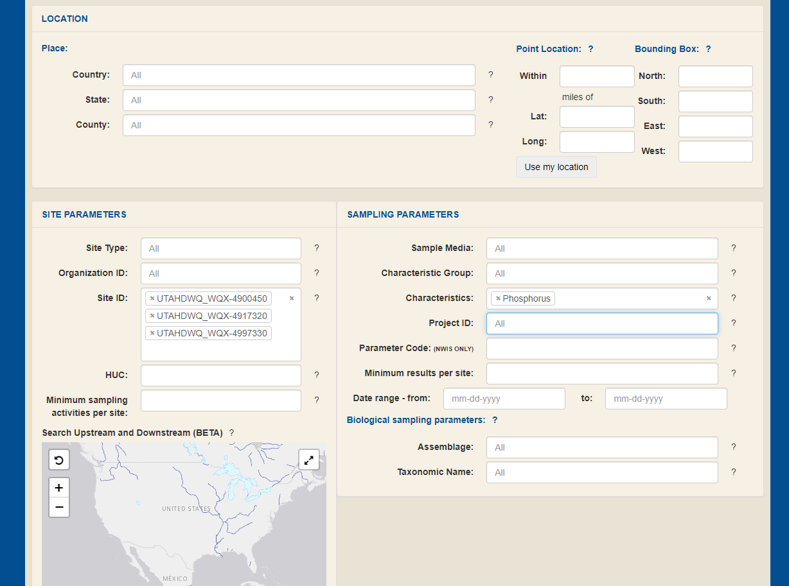
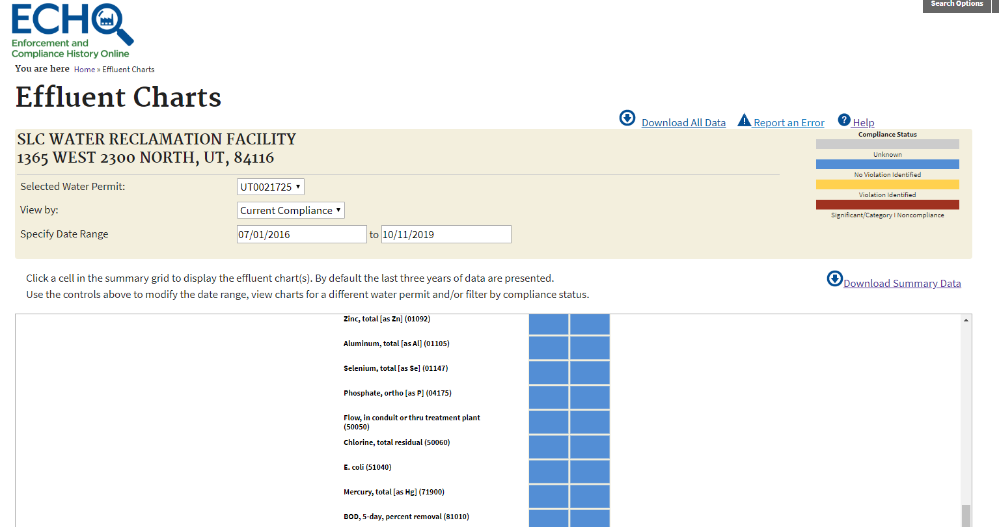
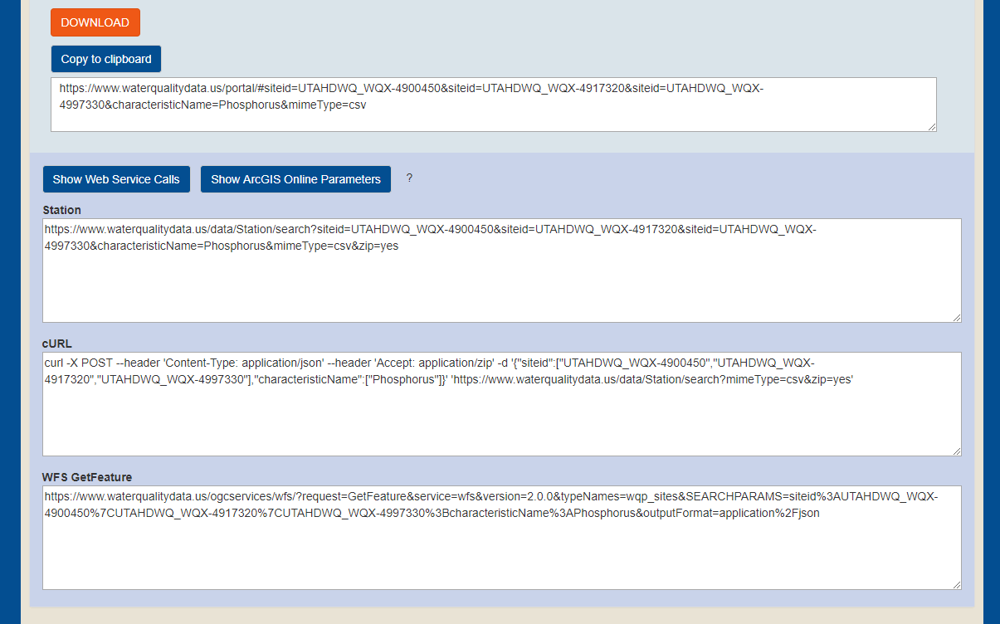

---
output:
  revealjs::revealjs_presentation:
    transition: none
    background_transition: none
---

# Open source tools at Utah DWQ

<h4>Jake Vander Laan (jvander@utah.gov)</h4>  
<h4>Elise Hinman (ehinman@utah.gov)</h4>  
```{r, echo=F, fig.align="center"}
knitr::include_graphics('images/title-logo.PNG')
```

# To view slide info (not published yet):
<h2>**[bookdown.org/jakevl/udwq-open-source](https://bookdown.org/jakevl/udwq-open-source/){target="_blank"}**</h2>

# Why use open source?

- Transparency
- Repeatability
- Efficiency
- Ownership


# What platforms do we use?

## R
R is an open source statistical program and coding language.  
[r-project.org](https://www.r-project.org/){target="_blank"}  
<br>
Robust user community of coders & problem solvers.  
Fully customizable.  
<br>

> Everything that exists is an object.  
> Everything that happens is a function call.  
> --- John Chambers  
<br>

**Functions & packages**  
*Function*  
A block of code that performs a particular task or set of tasks. A function has a name, **arguments**, a body (code), and a return value.  
<br>

*Argument*  
Change-able inputs to a function.  
<br>

*Package*  
A portable collection of R functions.  
<br>

## R documentation 

- Help files
```{r, out.width='65%', fig.align="left", echo=F}
knitr::include_graphics('images/assignAUs-help.PNG')
```

- [Package manuals](https://github.com/ut-ir-tools/irTools/blob/master/irTools_0.0.0.9000.pdf){target="_blank"}  


## Markdown
Text formatting syntax that allows conversion of plain text to rich text HTML, PDF, and other document types including tables, figures, and source code.

- Documents (package rmarkdown)
- Chapters & books (package bookdown)
- Presentations
- Websites 


## GitHub
Collaborative code writing, versioning, & sharing platform.  
Individuals, organizations, teams, and repositories.  

**DWQ GitHub organization**  
A location for DWQ staff to store, collaborate, and share repositories.  
[github.com/utah-dwq](https://github.com/utah-dwq){target="_blank"}  

**DWQ R packages**  
DWQ has two packages in current development. These can be viewed and installed via GitHub.  

* [wqTools](https://github.com/utah-dwq/wqTools){target="_blank"}  
* [irTools](https://github.com/utah-dwq/irTools){target="_blank"}  
<br>

**Installing packages from GitHub**  
```{r, eval=F}
install.packages('devtools')
devtools::install_github('utah-dwq/irTools')
library(irTools)
asmntDashboard()
```

## Data portals & web services
**Water quality data portal**  
[waterqualitydata.us/portal](https://www.waterqualitydata.us/portal/){target="_blank"}  
```{r, echo=F, fig.align="center"}

```
<br>
**ECHO** 
```{r, echo=F, fig.align="center"}

```
<br>
**Web service capabilities**
```{r, echo=F, fig.align="center"}

```
<br>
```{r, eval=F}
library(wqTools)
two_site_nr=readWQP(type="narrowresult",
			        siteid=c("UTAHDWQ_WQX-4900440","UTAHDWQ_WQX-4900470"), 
					start_date="01/01/2016", end_date="12/31/2018")

utah_lake_nr=readWQP(type="narrowresult",
   					 auid=c('UT-L-16020201-004_01', 'UT-L-16020201-004_02'),
   					 start_date="01/01/2016", end_date="12/31/2018",
   					 siteType=c("Lake, Reservoir, Impoundment","Stream"),
   					 print=F)
```
<br>
```{r, echo=F, cache=T}
library(leaflet)
ul_poly=subset(wqTools::au_poly, ASSESS_ID %in% c('UT-L-16020201-004_01', 'UT-L-16020201-004_02'))
bbox=sf::st_bbox(ul_poly)
map3=wqTools::buildMap(plot_polys=F) %>% 
	addPolygons(data=ul_poly, popup=~ASSESS_ID) %>% 
	addLayersControl(
		position ="topleft",
		baseGroups = c("Topo","Satellite")) %>%
	fitBounds(bbox[[1]], bbox[[2]], bbox[[3]], bbox[[4]]) %>%
	leaflet.extras::removeSearchFeatures()
htmlwidgets::saveWidget(map3, file=paste0(getwd(),'/figures/map3.html'))
```
<iframe src="figures/map3.html" style="height:450px;width:800px"></iframe>


## R-Shiny
Shiny is an R package for building interactive web applications to visualize and analyze data and communicate analytical results.  
<br>
```{r, echo=F}
knitr::include_app("https://jakevl.shinyapps.io/shiny-example", height="400px")
```


# What do we use open source tools for?

- Querying/downloading data  
- Water quality assessments
- Data visualization

# Our general approach

1. Reusable, generalizable ***<span style="color:#2e6da4">functions</span>*** with flexible inputs
2. Use ***<span style="color:#2e6da4">arguments</span>*** to modify functions, instead of re-programming
3. Link ***<span style="color:#2e6da4">functions in series</span>*** to perform analyses
4. ***<span style="color:#2e6da4">Document</span>*** functions and analyses
5. Use ***<span style="color:#2e6da4">interactive</span>*** figures and applications to enhance user understanding

# Examples


<style>
.reveal p {
  text-align: left;
}
.reveal ul {
  display: block;
}
.reveal ol {
  display: block;
}  
.reveal section img { background:none; border:none; box-shadow:none; }
.slide {
    height: 700px;
    overflow-y: auto !important;
}
body:after {
content: url(images/dwq_logo_small.png);
position: fixed;
bottom: 3.5em;
left: 3.5em;
}
</style>


